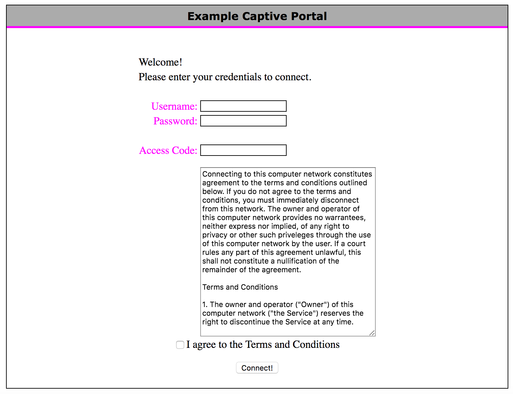

# Captive Portal | Net | Quickstarts

## Resources
- [OpenWrt](https://openwrt.org/) - OSi (Linux distro) used for embedded system for routers and other network embedded devices.
    - [Captive portals (splash pages for an open/paid Wi-Fi hotspot)](https://openwrt.org/docs/guide-user/services/captive-portal/start)
- [openNDS | GitHub](https://github.com/openNDS/openNDS) - *openNDS provides instant access control of an Internet connection along with a powerful API for development of advanced Captive Portal solutions.* Based on Nodogsplash (has more features).
    - [OpenNDS Captive Portal | openwrt.org](https://openwrt.org/docs/guide-user/services/captive-portal/opennds)
- [wifidog-gateway | GitHub](https://github.com/wifidog/wifidog-gateway) - *Repository for the wifidog-gateway captive portal designed for embedded systems.*
    - [WiFiDog captive portal | openwrt.org](https://openwrt.org/docs/guide-user/services/captive-portal/wireless.hotspot.wifidog)
- [Nodogsplash | GitHub](https://github.com/nodogsplash/nodogsplash) - *Nodogsplash offers a simple way to provide restricted access to an Internet connection using a captive portal. Pull requests are welcome!* Based of openNDS.
    - [Welcome to Nodogsplash’s documentation!](https://nodogsplashdocs.readthedocs.io/en/stable/)
    - [nodogsplashdocs.readthedocs.io](https://nodogsplashdocs.readthedocs.io/en/v4.5.0/overview.html)
    - [NoDogSplash Captive Portal | openwrt.org](https://openwrt.org/docs/guide-user/services/captive-portal/nodogsplash)
