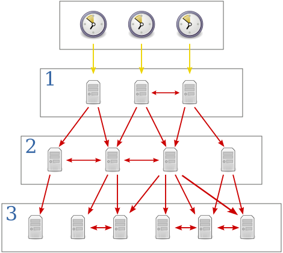

# NTP | Net | Quickstarts
- Network Time Protocol

## NTP Server
### By Countries
#### Canada
- time.nrc.ca
- time.chu.nrc.ca

### Sources
- https://nrc.canada.ca/en/certifications-evaluations-standards/canadas-official-time/network-time-protocol-ntp
- https://www.nist.gov/pml/time-and-frequency-division/time-distribution/internet-time-service-its
- https://tf.nist.gov/tf-cgi/servers.cgi - (NIST Internet Time Servers)
- https://aws.amazon.com/blogs/aws/keeping-time-with-amazon-time-sync-service/
- https://docs.aws.amazon.com/AWSEC2/latest/UserGuide/set-time.html
- https://www.ntppool.org/en/zone/ca - (Canada — ca.pool.ntp.org)
- https://www.ntppool.org/en/
- https://gist.github.com/mutin-sa/eea1c396b1e610a2da1e5550d94b0453 - (Top_Public_Time_Servers.md)
- https://timetoolsltd.com/information/public-ntp-server/
- https://www.ntppool.org/en/use.html
- https://www.inrim.it/en/research/scientific-sectors/time-and-frequency/ntp-network-time-protocol
- https://www.theregister.com/2016/12/02/google_public_ntp_servers/

## Resources
- [Network Time Security | draft-ietf-ntp-network-time-security-15 | IEFT](https://datatracker.ietf.org/doc/html/draft-ietf-ntp-network-time-security-15)
- [ioerror/tlsdate | GitHub](https://github.com/ioerror/tlsdate) - About secure parasitic rdate replacement
- [OpenNTPD](https://www.openntpd.org/)
- [National Vulnerability Database | GOV](https://nvd.nist.gov/)
- [Roughtime (2019) | Google Git](https://roughtime.googlesource.com/roughtime)
- [cloudflare/roughtime | GitHub](https://github.com/cloudflare/roughtime) - A secure clock-synchronization protocol for when rough is enough.
  - [Roughtime | Developers | Cloudflare](https://developers.cloudflare.com/time-services/roughtime/)
- [NTPsec](https://www.ntpsec.org/)
- [Recent Vulnerabilities (2020) Network Time Foundation NTP Support Wiki](https://www.ntp.org/support/securitynotice/#Recent_Vulnerabilities)
- [RFCs](https://www.ietf.org/standards/rfcs/)
- [Chapter 18. Configuring NTP Using the chrony Suite | RedHat](https://access.redhat.com/documentation/en-us/red_hat_enterprise_linux/7/html/system_administrators_guide/ch-configuring_ntp_using_the_chrony_suite)
- [Chapter 19. Configuring NTP Using ntpd | RedHat](https://access.redhat.com/documentation/en-us/red_hat_enterprise_linux/7/html/system_administrators_guide/ch-configuring_ntp_using_ntpd)
- [Network Time Protocol (NTP) | meinbergglobal.com](https://www.meinbergglobal.com/english/info/ntp.htm)
### Articles
- [What Is NTP? A Beginner’s Guide to Network Time Protocol](https://www.galsys.co.uk/news/what-is-ntp-a-beginners-guide-to-network-time-protocol/)
- [Network Time Protocol (NTP) - Feature Overview and Configuration Guide](https://www.alliedtelesis.com/sites/default/files/documents/configuration-guides/ntp_feature_overview_guide.pdf)
- [Network Time Protocol (NTP) | Geeks for Geeks](https://www.geeksforgeeks.org/network-time-protocol-ntp/)
- [Configure and Verify NTP Operating in Client and Server Mode | Geeks for Geeks](https://www.geeksforgeeks.org/configure-and-verify-ntp-operating-in-client-and-server-mode/)

### Books
- [The CISO’s Next Frontier | Springer Link](https://link.springer.com/chapter/10.1007/978-3-030-75354-2_23)
- [Expert Network Time Protocol: An Experience in Time with NTP | Amazon](https://www.amazon.ca/gp/product/1590594843/ref=ewc_pr_img_2)
- [NTP Security: A Quick-Start Guide | Amazon](https://www.amazon.ca/gp/product/1484224116/ref=ewc_pr_img_3)

## Credits
- https://en.wikipedia.org/wiki/Network_Time_Protocol#/media/File:Network_Time_Protocol_servers_and_clients.svg
