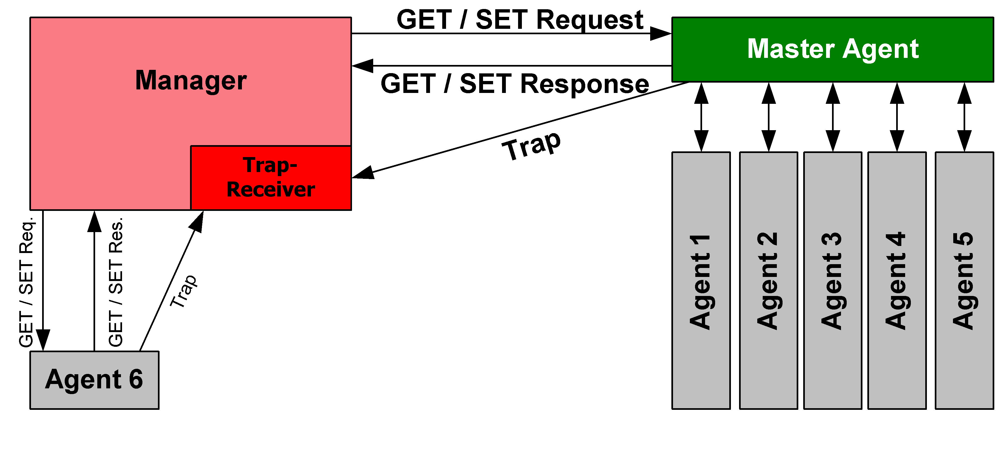
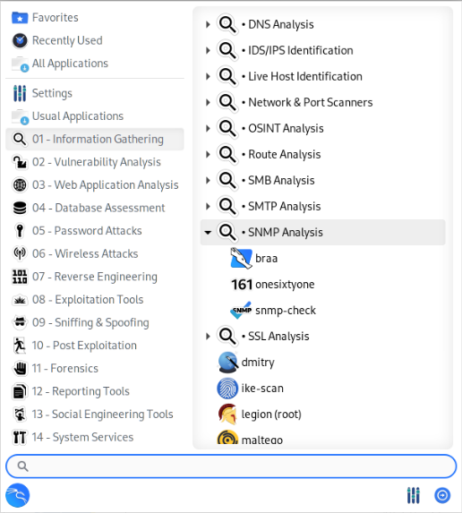

# <acronym title="Simple Network Management Protocol">SNMP</acronym> | Net | Quickstarts
- SNMP: Simple Network Management Protocol
- Allow devices to communicate management information to one another
- The dream: one admin can control an entire fleet (start process, close that interface, get rid of a user, see errors, deal with spammers, etc)

## Other Protocols
- IPX
- AppleTalk
- CLNS
- ...

## History
...

## System Components
- Similar to client-server model
- Diff to Secure Shell (SSH)
- Faster than SSH
- <acronym title="Simple Network Management Protocol">**SNMP**</acronym> *manager* is the client software that issues requests
  - Named manager because (expected) it extracts management information from devices and also can issue commands to them
- <acronym title="Simple Network Management Protocol">**SNMP**</acronym> *agent* is a server
  - Runs devices like: router, server, or workstation
  - More dynamic than most server software
  - Can help with confuguring the host
  - Gets information on the local system and sends back info to the *manager*
- <acronym title="Network Management System"><strong>NMS</strong></acronym> is for collecting data and issue commands to agents
  - It might run tools for managing systems via several other protocols
  - Transforms **SNMP** and other data into pretty human-readable graphs so you can make decisions
  - Sometimes refered as *monitoring systems*
  - Monitoring systems: 
    - Cacti
    - MRTG
    - Graphite
    - ...
  - Full-featured NMSes
    - OpenNMS
    - HP BTO/OpenView
  - Other NMSes (partial support for **NMS**): 
    - Zabbix
    - Nagios
    - Icinga
## How is SNMP Used
...

## Kali Linux Tools
Here are the tools in Kali Linux that are specific to work with SNMP: 

- [`braa`](https://www.kali.org/tools/braa/) [Home page](http://s-tech.elsat.net.pl/) - Mass SNMP scanner (like: snmpget or snmpwalk from net-snmp). Very fast!
- [`onesixtyone`](https://www.kali.org/tools/onesixtyone/) [Home page](https://github.com/trailofbits/onesixtyone) - Fast SNMP Scanner.
- [`snmp-check`](https://www.kali.org/tools/snmpcheck/) [Home page](http://www.nothink.org/codes/snmpcheck/index.php) [repo](https://gitlab.com/kalilinux/packages/snmpcheck) - Snmpcheck is an open source tool distributed under GPL license. Its goal is to automate the process of gathering information of any devices with SNMP protocol support (Windows, Unix-like, network appliances, printers...). Like to snmpwalk, snmpcheck allows you to enumerate the SNMP devices and places the output in a very human readable friendly format. It could be useful for penetration testing or systems monitoring.

## Tools
- [Netdisco Project - Netdisco and SNMP-Info | GitHub](https://github.com/netdisco)

## Resources
- Books: 
  - [SNMP Mastery (It Mastery)](https://www.amazon.com/SNMP-Mastery-Michael-W-Lucas/dp/1642350370/)
  - [Essential SNMP: Help for System and Network Administrators](https://www.amazon.ca/Essential-SNMP-Second-Douglas-Mauro/dp/0596008406/)

## Credits
- https://en.wikipedia.org/wiki/Simple_Network_Management_Protocol#/media/File:SNMP_communication_principles_diagram.PNG
