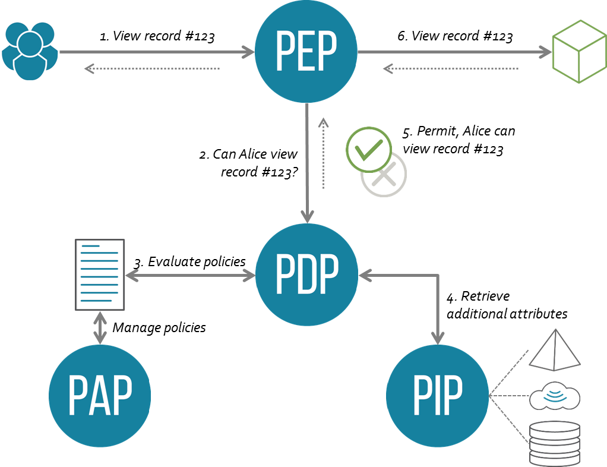

# XACML | Policy Management | ZTNA | Net | Quickstarts
eXtensible Access Control Markup Language (XACML)
- [Abbreviated Language for Authorization (ALFA) | Wikipedia](https://en.wikipedia.org/wiki/Abbreviated_Language_for_Authorization)
- [XACML](https://en.wikipedia.org/wiki/XACML)

## Flow
Source: https://en.wikipedia.org/wiki/XACML
1. A user sends a request which is intercepted by the Policy Enforcement Point (PEP)
2. The PEP converts the request into a XACML authorization request
3. The PEP forwards the authorization request to the Policy Decision Point (PDP)
4. The PDP evaluates the authorization request against the policies it is configured with. The policies are acquired via the Policy Retrieval Point (PRP) and managed by the Policy Administration Point (PAP). If needed it also retrieves attribute values from underlying Policy Information Points (PIP).
5. The PDP reaches a decision (Permit / Deny / NotApplicable / Indeterminate) and returns it to the PEP

## Tools
- [Axiomatics](https://axiomatics.com/)
- [AuthzForce | GitHub](https://github.com/authzforce)
  - [AuthzForce (Community Edition) | ow2](https://authzforce.ow2.org/)
